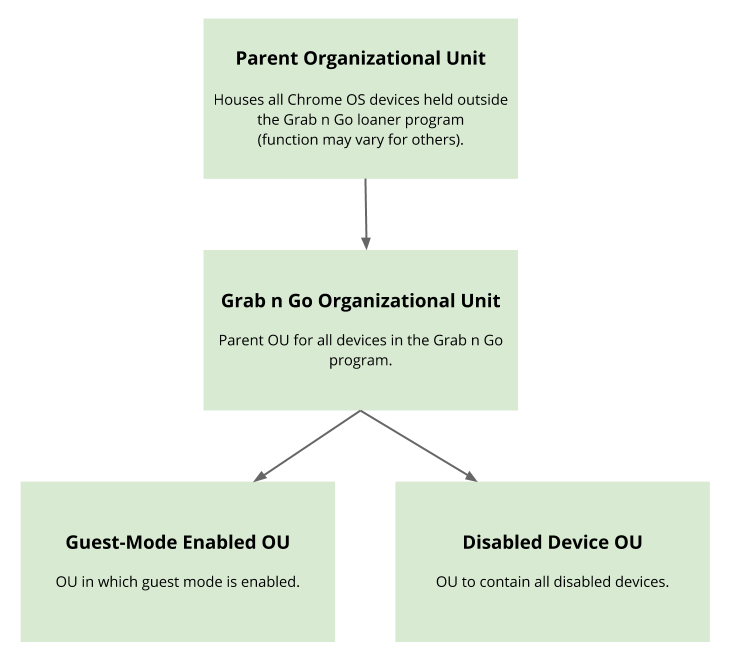

# Configure the G Suite Environment

## Set Up G Suite

### Create a G Suite Account

To manage, configure, and use Chrome OS devices in an enterprise setting, you
must have a [G Suite] account. To set up and configure a G Suite account, see [G
Suite Sign-Up Help].

### [Configure the Organizational Unit](https://support.google.com/a/answer/182537?hl=en)

When setting up GnG, it's highly recommended that you separate device management
into discrete organizational units (OU) from the root organizational unit (the
figure below displays the Google organizational unit configuration). Doing so
enables you to:

*   Manage your GnG fleet separately from all the other Chrome OS devices
    managed by your enterprise.

*   Enable or disable guest mode on devices in the loaner program. Disabled
    devices are moved to a separate OU.

{width="450"}

NOTE: Creating either a device or user OU is fine as the OUs will be able to be
used for both user and device management.

## GnG Organizational Unit Settings

Lets go ahead and modif some of the setting in our newly created Grab n Go OU.

1.  Go to the [Admin Console](http://admin.google.com).

1.  Open Device Management.

1.  Under Device Settings, click Chrome Management.

### User Settings

| Setting                             | Description                            |
| ----------------------------------- | -------------------------------------- |
| **Enrollment Controls**             |                                        |
| Enrollment Permissions (default)    | Allow users in this organization to    |
|                                     | enroll new or deprovisioned devices.   |
|                                     | Should the device be wiped, this       |
|                                     | policy automatically forces the device |
|                                     | to re-enroll to the domain. For        |
|                                     | convenience and a better user          |
|                                     | experience, all domain users have the  |
|                                     | ability to enroll the device. This     |
|                                     | saves time since users don't need      |
|                                     | technical assistance.                  |
| **Apps and Extensions**             |                                        |
| Force-installed Apps and Extensions | Use this mechanism to install a loaner |
|                                     | companion app. This Chrome OS app is   |
|                                     | pushed to all users in the domain, but |
|                                     | the app only reports those devices     |
|                                     | already enrolled in the GnG loaner OU. |

### Device Settings

| Setting                             | Description                            |
| ----------------------------------- | -------------------------------------- |
| **Enrollment & Access**             |                                        |
| Forces Re-enrollment                | To prevent device theft, set this      |
|                                     | configuration to *Force device to*     |
|                                     | *re-enroll into this domain after*     |
|                                     | *wiping*. Use a key combination to     |
|                                     | easily wipe a Chrome OS device. When a |
|                                     | device is wiped, force the user to     |
|                                     | re-enroll the device to the domain so  |
|                                     | that you can reset any custom          |
|                                     | policies. If not, a user could wipe    |
|                                     | the device and use it at will.         |
| Verified Access                     | Ensures that all executed code comes   |
|                                     | from the Chromium OS source tree       |
|                                     | rather than from an attacker,          |
|                                     | corruption, or other untrusted source. |
|                                     | Setting this to *Enabled for*          |
|                                     | *Enterprise Extensions* and *Enabled*  |
|                                     | *for Content Protections* ensures that |
|                                     | Chrome OS devices verify their         |
|                                     | identity to content providers using a  |
|                                     | unique key provided by the device’s    |
|                                     | TPM. If either are disabled, Chrome OS |
|                                     | extensions can't interact with the     |
|                                     | device's TPM.                          |
| Verified Mode                       | Require verified mode boot for         |
|                                     | Verified Access. For device            |
|                                     | verification to succeed, a device must |
|                                     | be running in verified boot mode.      |
|                                     | Devices in dev mode always fail the    |
|                                     | Verified Access check. Having a fleet  |
|                                     | of Chrome OS devices in dev mode is    |
|                                     | insecure and highly unstable. Disabled |
|                                     | device return instruction              |
| **Sign-in Settings**                |                                        |
| Guest Mode                          | Google does not allow guest mode for   |
|                                     | loaner Chromebooks. If guest mode is   |
|                                     | enabled, a user could pick up a loaner |
|                                     | device and use it without being signed |
|                                     | in. We rely on login information to    |
|                                     | retroactively assign Chromebooks. If   |
|                                     | devices are manually assigned at the   |
|                                     | time of distribution, then this risk   |
|                                     | is not present. Note: The GnG program  |
|                                     | uses a Guest mode OU that has Guest    |
|                                     | Mode enabled. When a GnG customer opts |
|                                     | into guest mode, we automatically move |
|                                     | them to the Guest OU for a fixed       |
|                                     | duration of time. This opt-in happens  |
|                                     | after we have recorded their sign-in   |
|                                     | and use of the device.                 |
| Sign-in Restriction                 | Restrict the sign-in to domain users   |
|                                     | only. For example, @example.com. Doing |
|                                     | so allows only domain users to log in  |
|                                     | to the device (no @gmail.com login).   |
| Autocomplete Domain                 | Use the domain name, set Sign-in       |
|                                     | Restriction, for autocomplete. (This   |
|                                     | must be the domain name for the        |
|                                     | account).                              |
| Sign-in Screen                      | Set to *Never show user names and*     |
|                                     | *photos*. This setting is important if |
|                                     | you chose to not erase user data upon  |
|                                     | logout. If not set this way, the       |
|                                     | usernames of previous users and photos |
|                                     | will be present. Some users may be     |
|                                     | unsettled by the thought that their    |
|                                     | data remains on the loaner device      |
|                                     | after they've used it. It's important  |
|                                     | to note that all user data is          |
|                                     | encrypted by default on Chrome         |
|                                     | devices. So while it may be            |
|                                     | uncomfortable for some users that      |
|                                     | previous user data is on the device-   |
|                                     | it poses virtually no security risk.   |
| User Data                           | Set to *Erase all local user data*.    |
|                                     | Related to the note above, since this  |
|                                     | will be a loaner device, you don't     |
|                                     | want to leave the data of other users  |
|                                     | behind, even if that data is           |
|                                     | encrypted. At times, Google found that |
|                                     | this data wipe prevented reporting     |
|                                     | check-ins. If a loaner was used for a  |
|                                     | short duration, usage data could be    |
|                                     | wiped before there was a chance to     |
|                                     | autonomously account for it.           |
| Sign-In Language                    | Set to company primary language. This  |
|                                     | is to prevent a user from changing     |
|                                     | language and then the user that        |
|                                     | follows not knowing the language.      |
| **Device Update Settings**          |                                        |
| Auto Update Settings                | Set to Allow auto-updates. For         |
|                                     | security reasons, perform all updates  |
|                                     | on the device.                         |
| Auto Reboot After Updates           | Set to Allow auto-reboots. Chrome OS   |
|                                     | requires a reboot to apply the latest  |
|                                     | downloaded update. Auto-reboot helps   |
|                                     | you to install the updates without     |
|                                     | human intervention. When Allow         |
|                                     | auto-reboots is selected, after a      |
|                                     | successful auto update, the Chrome     |
|                                     | device will reboot when the user next  |
|                                     | signs out.                             |
| Release Channel                     | Set to Move to Stable Channel. For     |
|                                     | optimal stability, all devices must be |
|                                     | set to Move to Stable Channel.         |
| **Kiosk Settings**                  |                                        |
| Public Session Kiosk                | Set to Do not allow Public Session     |
|                                     | Kiosk. Public Session Kiosks do not    |
|                                     | use an account for logging in to the   |
|                                     | device. Without having an account that |
|                                     | is logged into the device, the device  |
|                                     | can't be assigned to a user.           |
| **User & Device Reporting**         |                                        |
| Device Reporting                    | Enable device state reporting and      |
|                                     | enable tracking recent device users.   |
|                                     | Google uses this data to record who is |
|                                     | using a device and when. This data is  |
|                                     | also facilitates communication with    |
|                                     | GnG customers.                         |
| **Power & Shutdown**                |                                        |
| Power Management                    | Set to Allow device to sleep/shut down |
|                                     | when idle on the sign in screen. When  |
|                                     | the device is not in use, allowing it  |
|                                     | to sleep/shutdown maximizes battery    |
|                                     | life.                                  |

## Device Enterprise Enrollment

All Chrome OS devices must be enterprise enrolled so that your organization can
enforce policies on each device. A manual enrollment process is required for
every device.

## [How to Enterprise Enroll a Device](https://support.google.com/chrome/a/answer/1360534?hl=en)

## Force install Chrome App by OU

Set up the application to be pushed to all Chromebooks in your domain.

If a device is not already [enterprise enrolled], the application will disable
itself and become dormant.

To create an installation policy:

1.  Go to the [Admin Console](http://admin.google.com).

1.  Open Device Management.

1.  Under Device Settings, click Chrome Management.

1.  Click App Management.

1.  Under Filters, find the label named Type and change the type to Domain Apps.

    The names of all domain apps available to your domain are listed.

1.  Find the loaner application that you deployed previously and click on the
    name.

1.  Click User Settings.

1.  Find the OU that your users belong to (most likely the parent OU, for
    example, example.com) and click on it.

1.  For that OU, you can now configure how the application is to be deployed.
    The following configuration is recommended:

    *   Allow Installation: Disabled (to prevent users from manually installing
        the application)

    *   Force Installation: Enabled (everyone can install the application — this
        option is required for the application to open upon log-in)

    *   Pin to Taskbar: Enabled (pins the application to the bottom taskbar)

1.  Click Save.

[G Suite]: https://gsuite.google.com/
[G Suite Sign-Up Help]: https://docs.google.com/document/d/1qUpgVzCttLiZJ-s5nhXEfuFdHBGNWjPvNRK40pcU9m0/edit#heading=h.5xt9ofon499z
